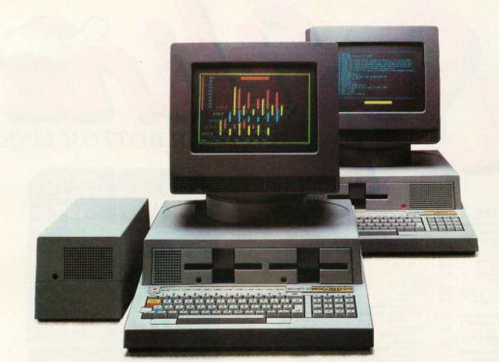
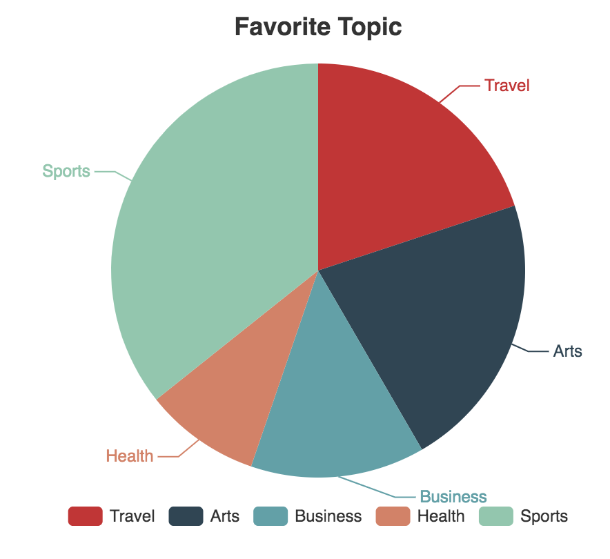
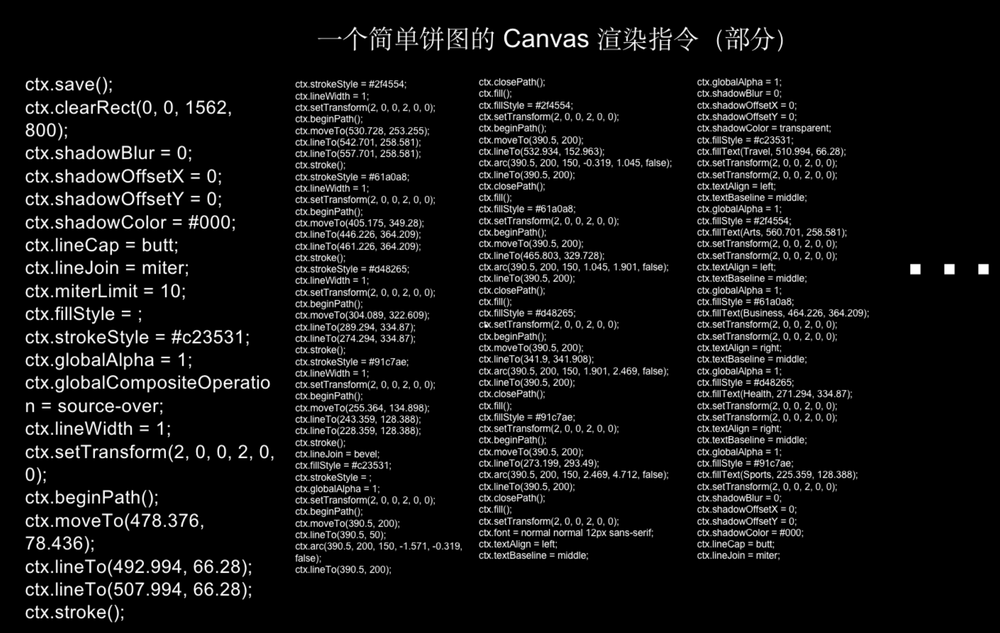
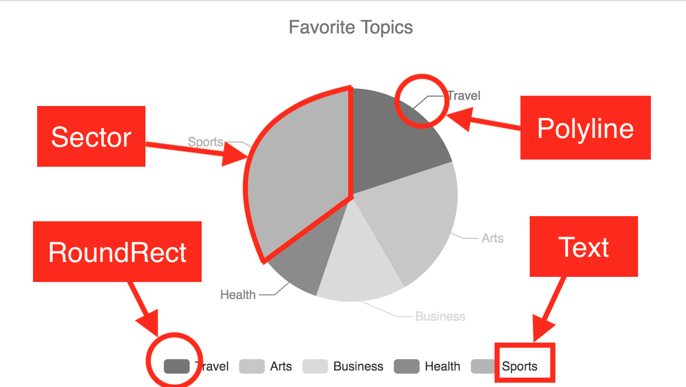

# 这是个主标题 这是个主标题 这是个主标题
<!-- {qwerthreading} {qwerthinkinginguithreading} {qwerguithreading} {qwerthinking} {qwergui} -->
<!-- @author: 100pah -->

[[toc]]


## 这是一个二级标题

### 这是一个三级标题

+ 这是第一层 这是第一层 这是第一层 这是第一层 这是第一层 这是第一层
    + 这是第二层 这是第二层 这是第二层 这是第二层 这是第二层 这是第二层
        + 这是第三层 这是第三层 这是第三层 这是第三层 这是第三层 这是第三层
    + 这是第二层 这是第二层 这是第二层 这是第二层 这是第二层 这是第二层
        + 这是第三层 这是第三层 这是第三层 这是第三层 这是第三层 这是第三层
+ 这是第一层 这是第一层 这是第一层 这是第一层 这是第一层 这是第一层
+ 这是第一层 这是第一层 这是第一层 这是第一层 这是第一层 这是第一层
+ 这是第一层 这是第一层 这是第一层 这是第一层 这是第一层 这是第一层
    + 这是第二层 这是第二层 这是第二层 这是第二层 这是第二层 这是第二层
    + 这是第二层 这是第二层 这是第二层 这是第二层 这是第二层 这是第二层
        + 这是第三层 这是第三层 这是第三层 这是第三层 这是第三层 这是第三层
        + 这是第三层 这是第三层 这是第三层 这是第三层 这是第三层 这是第三层

### 这是一个三级标题

## 这是一个二级标题


## 这是一个二级标题 This is title level2 是不是
<!-- 意：长、复杂；类似 -->

+ 图形库例 · skia API
    + 用于 chromium, Android UI, flutter 等。
    ```cpp
    void draw(SkCanvas* canvas) {
        const SkScalar scale = 256.0f;
        const SkScalar R = 0.45f * scale;
        const SkScalar TAU = 6.2831853f;
        SkPath path;
        path.moveTo(R, 0.0f);
        for (int i = 1; i < 7; ++i) {
            SkScalar theta = 3 * i * TAU / 7;
            path.lineTo(R * cos(theta), R * sin(theta));
        }
        path.close();
        SkPaint p;
        p.setAntiAlias(true);
        canvas->clear(SK_ColorWHITE);
        canvas->translate(0.5f * scale, 0.5f * scale);
        canvas->drawPath(path, p);
    }
    ```
    + 参考：
        + https://skia.org/docs/user/api/skcanvas_overview/
        + https://github.com/flutter/engine/blob/main/lib/ui/painting/canvas.cc#L235

+ 图形库例 · Quartz API
    + 用于苹果系列 （in core graphics）
    + 参考：
        + https://developer.apple.com/library/archive/documentation/GraphicsImaging/Conceptual/drawingwithquartz2d/dq_paths/dq_paths.html#//apple_ref/doc/uid/TP30001066-CH211-TPXREF101

+ 对应用直接提供的 2D API 例 · HTML canvas API
    ```js
    function draw() {
        const canvas = document.getElementById('canvas');
        const ctx = canvas.getContext('2d');
        ctx.fillStyle = 'red';
        ctx.beginPath();
        ctx.moveTo(75, 50);
        ctx.lineTo(100, 75);
        ctx.lineTo(100, 25);
        ctx.fill();
    }
    ```
    + 参考： https://developer.mozilla.org/en-US/docs/Web/API/Canvas_API/Tutorial/Drawing_shapes

+ 对应用直接提供的 2D API 例 · Android canvas API
    + 参考： https://developer.android.com/reference/android/graphics/Canvas#drawPath(android.graphics.Path,%20android.graphics.Paint)

+ 特点
    + command 序列风格
    + 状态全局

#### 这是一个四级标题？是的
<ul class="img-line">
    <li style="width: 50%"></li>
</ul>

+ 以 windows 2000/NT GDI (Graphics Device Interface) 为例：
    + OS 对 graphics device (device driver interface, DDI) 的抽象
    + GDI 内部层级：
        1. top layer: 应用程序 API （OS 提供）
        2. middle layer: graphics engine （OS 提供）
        3. bottom layer: graphics device drivers （厂商提供，OS 提一定要求）
    + DDI (Device Driver Interface)
        + Provided by hardware manufacturers.
        + 举例：
            Index Graphics | Engine Function | Driver Function
            -------- | ------ | ------
            HOOK_TEXTOUT | EngTextOut | DrvTextOut
            HOOK_PAINT | EngPaint | DrvPaint
            HOOK_STROKEPATH | EngStrokePath | DrvStrokePath
            HOOK_FILLPATH | EngFillPath | DrvFillPath
            HOOK_STROKEANDFILLPATH | EngStrokeAndFillPath | DrvStrokeAndFillPath
            HOOK_LINETO | EngLineTo | DrvLineTo
            HOOK_COPYBITS | EngCopyBits | DrvCopyBits
            ... | ... | ...
    + DeviceContext
        + storing commonly used drawing attributes, such that individual drawing calls do not have to carry these settings over:
            + Coordinate space, mapping modes, and world coordinate transformation.
            + Foreground color, background color, palette, and color management settings.
            + Line-drawing settings.
            + Area-filling settings.
            + Font, character spacing, and text alignment.
            + Bitmap stretching settings.
            + Clipping.
    + 参考：
        + `Windows Graphics Programming_ Win32 GDI and DirectDraw`


### 这是一个三级标题？是的

+ 默认图片宽度
<ul class="img-line">
    <li></li>
    <li></li>
</ul>

+ 使用 flex 调整图片宽度
<ul class="img-line">
    <li style="flex: 3"></li>
    <li style="flex: 5"></li>
</ul>


+ 单个图片居中
<ul class="img-line">
    <li style="width: 60%"></li>
</ul>


+ 由极简到复杂，历史
    + 原始 GDI 由来（skia html canvas2d 等，表达 api 特征和业务开发不足） 见 qwer2dapihistory


## 这是一个很长的二级标题 This is a long level2 title 这是一个很长的二级标题

这是文字
这是文字
这是文字
这是文字
这是文字
这是文字

### 这是一个很长的三级标题 This is a long level3 title 这是一个很长的三级标题

这是文字

### 这是一个很长的三级标题 This is a long level3 title 这是一个很长的三级标题

这是文字
这是文字
这是文字

#### 这是一个很长的四级标题 This is a long level4 title 这是一个很长的四级标题

这是文字

### 这是一个很长的三级标题 This is a long level3 title 这是一个很长的三级标题

这是文字
这是文字
这是文字

## 这是一个二级标题

## 这是一个很长的二级标题 This is a long level2 title 这是一个很长的二级标题


